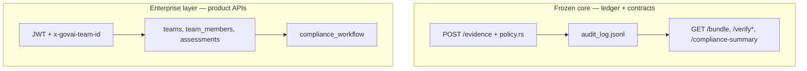
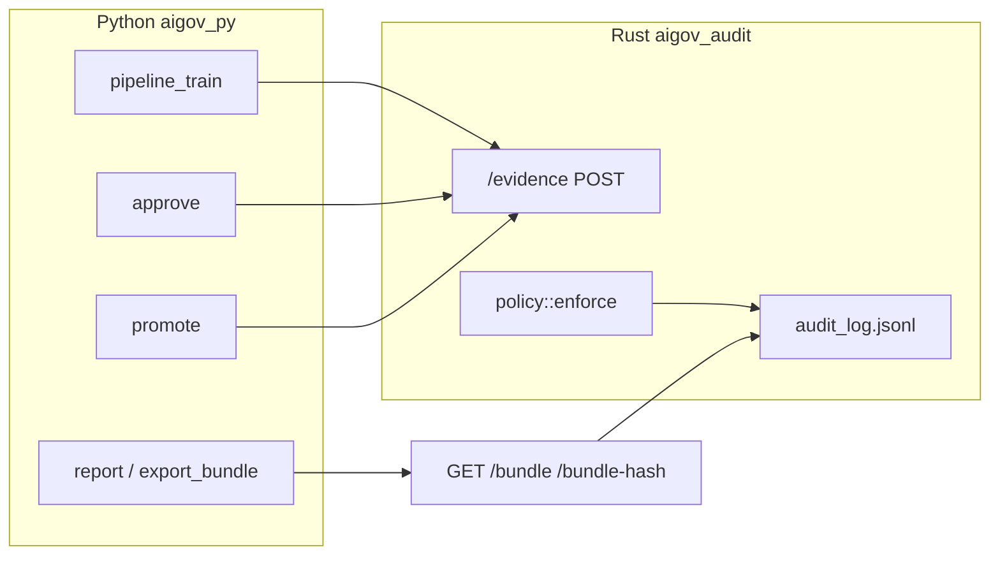

# Architecture

This document describes the implemented layout: binaries, HTTP surface, on-disk artifacts, and main entrypoints.

## Core vs enterprise layer

The repository ships **one Rust binary** with both surfaces merged at the router (`rust/src/main.rs`). The **split is semantic**, not structural: there is no separate OSS-only crate; instead, **frozen core** vs **enterprise layer** is defined by **which routes and data** you rely on.

There is **no edge** between the two subgraphs on purpose: enterprise tables and JWT **do not** append to the ledger or replace policy enforcement. See [ENTERPRISE_LAYER.md](ENTERPRISE_LAYER.md).

| Layer | What it is | Stability expectation |
|-------|------------|------------------------|
| **Core (frozen)** | Append-only `audit_log.jsonl`, `policy.rs` enforcement on `POST /evidence`, bundle/projection/compliance-summary routes that read the log only (`/bundle`, `/bundle-hash`, `/compliance-summary`, `/verify*`). Event schema (`schema.rs`), canonical contracts in [docs/strong-core-contract-note.md](docs/strong-core-contract-note.md). | This is the **portable regulation-agnostic contract**; changes are intentional and versioned. |
| **Enterprise layer** | Supabase JWT auth and team-scoped **`/api/*`** routes: **`/api/me`**, **`/api/assessments`**, **`/api/compliance-workflow*`** backed by Postgres **`teams`**, **`team_members`**, product **RBAC** (`rust/src/rbac.rs`), **`compliance_workflow`** (migration `0003_compliance_workflow.sql`). Dashboard + Python Supabase helpers target this stack. | **Optional product layer** (same repo): **not** the same stability or portability guarantee as the core ledger API. Detail: [ENTERPRISE_LAYER.md](ENTERPRISE_LAYER.md). |

---

## Product Scope

GovAI is a CI compliance gate for AI systems with audit evidence export.

It:

- accepts evidence via POST /evidence
- enforces policy constraints at write time
- produces deterministic decision via GET /compliance-summary
- blocks CI if verdict != VALID
- exports audit data via GET /api/export/:run_id

Guarantees:

- deterministic decision for given evidence + policy_version
- append-only evidence log
- hash chaining integrity

Non-guarantees:

- not a legal certification
- not full compliance coverage
- does not generate missing evidence

## When to use GovAI

- deploying ML models via CI/CD
- enforcing approval workflows before release
- requiring audit evidence for decisions

## Decision states

VALID:  
All required evidence present. Deployment allowed.

INVALID:  
Evidence present but fails policy. Deployment rejected.

BLOCKED:  
Not eligible for promotion (missing evidence and/or unmet approval/promotion prerequisites). Deployment halted.

**Explicit separation (reuse / integration):**

| If you need only… | Integrate with… | You can ignore… |
|-------------------|-----------------|-----------------|
| Hash-chained evidence + policy + bundle/summary contracts | Core HTTP routes above + contract note | `DATABASE_URL`, Supabase, `/api/*`, dashboard |
| Team-scoped UI + workflow queue + assessments | `DATABASE_URL`, JWT, `/api/*`, migrations | — |

**What belongs in which layer (quick check):**

- **Core:** hash chain, `POST /evidence`, `policy.rs`, read-only bundle/verify/compliance-summary from the log. No JWT, no team rows, no workflow table.
- **Enterprise:** JWT validation, `x-govai-team-id` resolution, role → permission checks, `compliance_workflow` state. Does **not** append to the ledger or replace `policy.rs`.

**Rule of thumb:** anything that **writes** hash-chained evidence or enforces `policy.rs` is core. Anything that **scopes users to a team**, checks **JWT + DB role permissions**, or stores **workflow rows** is enterprise layer and does **not** replace or append to the immutable ledger.

**Process note:** the server builds a Postgres pool at startup (`DATABASE_URL`); core routes do not use JWT, while **`/api/*`** requires it. See [ENTERPRISE_LAYER.md](ENTERPRISE_LAYER.md#boundaries-vs-frozen-core).

## High-level data flow

1. Python posts **evidence events** to `POST /evidence`.
2. Rust validates **policy**, rejects duplicates, appends a **hash-chained** record to `audit_log.jsonl`.
3. Bundle content is derived by reading the log (`GET /bundle`, `GET /bundle-hash`); Python may persist JSON under `docs/evidence/` and build reports/packs.

## Rust service (`rust/`, crate `aigov_audit`)

- **Binary**: `cargo run` from `rust/` (root `Makefile`: `audit` / `audit_bg`).
- **Default bind**: `127.0.0.1:8088` — override with `AIGOV_BIND`.
- **Startup line**: includes `environment` and `policy_version` (`rust/src/lib.rs`).
- **Policy version**: `v0.5_dev` / `v0.5_staging` / `v0.5_prod` from [`rust/src/govai_environment.rs`](rust/src/govai_environment.rs) (tier from `AIGOV_ENVIRONMENT` → `AIGOV_ENV` → `GOVAI_ENV`). Full rules: [docs/env-resolution.md](docs/env-resolution.md).
- **Audit log path** (relative to **process cwd**, typically `rust/`): `audit_log.jsonl` → from repo root: `rust/audit_log.jsonl`.
- **Database**: `DATABASE_URL` must be set; the server builds a Postgres pool at startup (`sqlx`). Routes under `/api/*` use this pool.

### HTTP routes (implemented)

| Method | Path | Purpose |
|--------|------|---------|
| GET | `/` | `ok`, `service` (`govai`), `version` (crate version) |
| GET | `/health` | `{"ok": true}` |
| GET | `/status` | `ok`, `policy_version`, `environment` (`dev` / `staging` / `prod`) — policy file knobs are **not** in this JSON (see `policy.*.json` / `rust/src/policy_config.rs`) |
| POST | `/evidence` | Ingest `EvidenceEvent`; policy gate; append to log |
| GET | `/usage` | Usage and limits (`metering` off/on shapes); canonical schema in [`api/govai-http-v1.openapi.yaml`](api/govai-http-v1.openapi.yaml) |
| GET | `/verify` | Full-chain integrity: `ok` + `policy_version`, or `error` on failure |
| GET | `/verify-log` | Compact JSON: `{"ok": true}` or `{"ok": false, "error": …}` |
| GET | `/bundle?run_id=…` | Bundle document (`schema_version`: `aigov.bundle.v1`, includes `events`, `identifiers`, derived sections) |
| GET | `/bundle-hash?run_id=…` | Canonical `bundle_sha256` for the run |
| GET | `/compliance-summary?run_id=…` | `ok` + `schema_version` `aigov.compliance_summary.v2`, `policy_version`, `run_id`; when `ok` is true — `verdict` (`VALID` / `INVALID` / `BLOCKED`) and `current_state`; when `ok` is false — `error` |
| GET | `/api/export/:run_id` | Machine-readable export (`aigov.audit_export.v1`); see OpenAPI |
| GET | `/api/me` | Supabase JWT — user + teams (each team includes `effective_role` + `permissions` from product RBAC; see `rust/src/rbac.rs`) |
| POST | `/api/assessments` | Create assessment row (auth + team resolution + **`decision_submit` permission**) |
| GET | `/api/compliance-workflow` | List workflow rows for resolved team; optional `?state=pending_review` (or other state). **200** includes `decision_authority` (ledger is primary; workflow is queue/override only). |
| POST | `/api/compliance-workflow` | Register `run_id` in `pending_review` (idempotent if already present); **200** includes `workflow` + `decision_authority`. |
| GET | `/api/compliance-workflow/:run_id` | Fetch one workflow row for the team; **200** includes `decision_authority`. |
| POST | `/api/compliance-workflow/:run_id/review` | Body `{"decision":"approve"\|"reject"}` — transitions from `pending_review` only; **200** includes `decision_authority`. |
| POST | `/api/compliance-workflow/:run_id/promotion` | Body `{"decision":"allow"\|"block"}` — transitions from `approved` only; **200** returns `ok` + `workflow` only (no `decision_authority` field). |

**HTTP contract (OpenAPI):** [`api/govai-http-v1.openapi.yaml`](api/govai-http-v1.openapi.yaml) — source of truth for v1 request/response shapes and `x-govai-surface` (`stable` vs `internal`). `GET /` is **internal**; all other routes in that file are **stable** for v1.

Auth for `/api/me`, `/api/assessments`, and `/api/compliance-workflow*` requires **`SUPABASE_URL`** at minimum (JWKS fetch); optional **`SUPABASE_JWT_AUD`** for audience checks — see `rust/src/auth.rs`. Team scope uses header **`x-govai-team-id`** when set (same as assessments). Without a valid `Authorization: Bearer` JWT, these routes return 401/403 as implemented.

**Compliance workflow (Postgres `compliance_workflow` table)** is **app-layer queue / override only** — not a second interpretation of compliance. Authoritative readiness remains **`GET /compliance-summary`**. Workflow does **not** append to `audit_log.jsonl` or change `policy.rs`. Evidence events (`human_approved`, `model_promoted`, …) remain separate: **manual** via Python/Makefile or any client calling `POST /evidence`. Permissions: list/get require **`review_queue_view`**; register + review require **`decision_submit`**; promotion requires **`promotion_action`** (see `rust/src/rbac.rs`).

## Policy and evidence schema

- **Deployment tier** (`dev` / `staging` / `prod`): resolution, ingest stamping, DB migration — [docs/env-resolution.md](docs/env-resolution.md). Policy files: **`AIGOV_POLICY_DIR`** (optional search root), then `policy.<env>.json` / `policy.json`, or **`AIGOV_POLICY_FILE`** — `rust/src/policy_config.rs`.
- Enforcement: `rust/src/policy.rs` on selected `event_type` values (e.g. `data_registered`, `model_trained`, `evaluation_reported`, risk lifecycle events, `human_approved`, `model_promoted`).
- Event shape: `rust/src/schema.rs` — JSON fields include `event_id`, `event_type`, `ts_utc`, `actor`, `system`, `run_id`, optional `environment` (stamped on ingest), `payload`.
- **Canonical identifiers** and summary contract: [docs/strong-core-contract-note.md](docs/strong-core-contract-note.md).

## Python package (`python/aigov_py`)

| Module / entry | Role |
|----------------|------|
| `pipeline_train` | Train iris baseline; emit events via `AIGOV_AUDIT_URL` (default `http://127.0.0.1:8088`); prints `done run_id=…` and approval hints |
| `approve` | POST `human_approved` for `RUN_ID` |
| `promote` | POST `model_promoted` (expects artifact on disk under `python/artifacts/`) |
| `fetch_bundle_from_govai` | `GET /bundle` + `/bundle-hash` → `docs/evidence/<run_id>.json` |
| `report` | Renders `docs/reports/<run_id>.md` from bundle JSON |
| `export_bundle` | Writes `docs/audit/<run_id>.json` and `docs/packs/<run_id>.zip` |
| `verify` | CLI checks local `docs/audit`, `docs/evidence`, `docs/reports` + `GET /verify-log` |
| `ci_fallback` | Synthetic evidence when fetch fails; **forbidden** when `AIGOV_MODE=prod` |
| `ingest_run` | Upserts run metadata to Supabase `runs` (+ storage hooks if configured) |
| `prototype_domain` | Shared IDs / governance payloads for the reference Iris flow |

Other Makefile-backed helpers (same package): `report_init`, `report_fill`, `audit_close`, `evidence_pack` — see root `Makefile` targets.

Environment variables commonly used: `RUN_ID`, `AIGOV_AUDIT_URL` / `AIGOV_AUDIT_ENDPOINT`, `AIGOV_MODE` (`ci` default; `prod` tightens evidence presence), `AIGOV_ACC_THRESHOLD`, `AIGOV_ACTOR`, `AIGOV_SYSTEM`.

## On-disk artifacts (by convention)

| Path | Content |
|------|---------|
| `rust/audit_log.jsonl` | Append-only stored records (hash chain) |
| `python/artifacts/model_<run_id>.joblib` | Trained model (promotion reads this path) |
| `docs/evidence/<run_id>.json` | Bundle JSON (often from live service via `fetch_bundle_from_govai`) |
| `docs/reports/<run_id>.md` | Human-readable audit report |
| `docs/audit/<run_id>.json` | Audit manifest with hashes (from `export_bundle`) |
| `docs/packs/<run_id>.zip` | Zip of evidence + report + audit JSON |

## Dashboard (`dashboard/`)

Next.js (App Router): `/login`, `/runs` (list), `/runs/[id]` (detail). Run rows come from **Supabase** after `db_ingest` (same project as dashboard env). Optionally set **`AIGOV_AUDIT_URL`** on the dashboard server so `/runs/[id]` can render the **frozen** `GET /compliance-summary` contract (no projection logic in the UI).

## EU AI Act (mapping only)

Mechanisms in this repo can be described in terms of EU AI Act articles as a framing for engineering mechanisms; mapping does not imply regulatory completeness. See [OPEN_SOURCE_SCOPE.md](OPEN_SOURCE_SCOPE.md).

## Known limitation (documented in contract note)

Compliance summary timing: `bundle_generated_at` behavior is constrained as described in [docs/strong-core-contract-note.md](docs/strong-core-contract-note.md).
