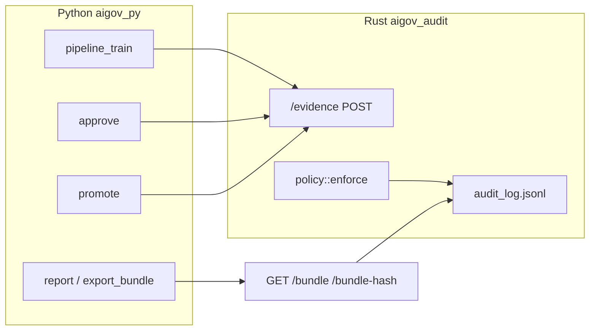

# Architecture (v0.1)

This document describes the **implemented** layout: binaries, HTTP surface, on-disk artifacts, and main Python entrypoints. It is **not** a roadmap.

## High-level data flow

1. Python posts **evidence events** to `POST /evidence`.
2. Rust validates **policy**, rejects duplicates, appends a **hash-chained** record to `audit_log.jsonl`.
3. Bundle content is derived by reading the log (`GET /bundle`, `GET /bundle-hash`); Python may persist JSON under `docs/evidence/` and build reports/packs.

## Rust service (`rust/`, crate `aigov_audit`)

- **Binary**: `cargo run` from `rust/` (root `Makefile`: `audit` / `audit_bg`).
- **Default bind**: `127.0.0.1:8088` — override with `AIGOV_BIND`.
- **Startup line**: `govai listening on http://{addr}` (`rust/src/main.rs`).
- **Policy version** (constant in `main.rs`): `v0.4_human_approval`.
- **Audit log path** (relative to **process cwd**, typically `rust/`): `audit_log.jsonl` → from repo root: `rust/audit_log.jsonl`.
- **Database**: `DATABASE_URL` must be set; the server builds a Postgres pool at startup (`sqlx`). Routes under `/api/*` use this pool.

### HTTP routes (implemented)

| Method | Path | Purpose |
|--------|------|---------|
| GET | `/` | `ok`, `service` (`govai`), `version` (crate version) |
| GET | `/health` | `{"ok": true}` |
| GET | `/status` | `{"ok": true, "policy_version": "<POLICY_VERSION>"}` |
| POST | `/evidence` | Ingest `EvidenceEvent`; policy gate; append to log |
| GET | `/verify` | Full-chain integrity: `ok` + `policy_version`, or `error` on failure |
| GET | `/verify-log` | Compact JSON: `{"ok": true}` or `{"ok": false, "error": …}` |
| GET | `/bundle?run_id=…` | Bundle document (`schema_version`: `aigov.bundle.v1`, includes `events`, `identifiers`, derived sections) |
| GET | `/bundle-hash?run_id=…` | Canonical `bundle_sha256` for the run |
| GET | `/compliance-summary?run_id=…` | `ok` + `schema_version` `aigov.compliance_summary.v2`, `policy_version`, `run_id`, `current_state` (projection; inner schema `aigov.compliance_current_state.v2`); or `ok:false` + `error` when the run cannot be loaded |
| GET | `/api/me` | Supabase JWT — user + teams |
| POST | `/api/assessments` | Create assessment row (auth + team resolution) |

Auth for `/api/me` and `/api/assessments` requires **`SUPABASE_URL`** at minimum (JWKS fetch); optional **`SUPABASE_JWT_AUD`** for audience checks — see `rust/src/auth.rs`. Without a valid `Authorization: Bearer` JWT, these routes return 401/403 as implemented.

## Policy and evidence schema

- Enforcement: `rust/src/policy.rs` on selected `event_type` values (e.g. `data_registered`, `model_trained`, `evaluation_reported`, risk lifecycle events, `human_approved`, `model_promoted`).
- Event shape: `rust/src/schema.rs` — JSON fields include `event_id`, `event_type`, `ts_utc`, `actor`, `system`, `run_id`, `payload`.
- **Canonical identifiers** and summary contract: [docs/strong-core-contract-note.md](docs/strong-core-contract-note.md).

## Python package (`python/aigov_py`)

| Module / entry | Role |
|----------------|------|
| `pipeline_train` | Train iris baseline; emit events via `AIGOV_AUDIT_URL` (default `http://127.0.0.1:8088`); prints `done run_id=…` and approval hints |
| `approve` | POST `human_approved` for `RUN_ID` |
| `promote` | POST `model_promoted` (expects artifact on disk under `python/artifacts/`) |
| `fetch_bundle_from_govai` | `GET /bundle` + `/bundle-hash` → `docs/evidence/<run_id>.json` |
| `report` | Renders `docs/reports/<run_id>.md` from bundle JSON |
| `export_bundle` | Writes `docs/audit/<run_id>.json` and `docs/packs/<run_id>.zip` |
| `verify` | CLI checks local `docs/audit`, `docs/evidence`, `docs/reports` + `GET /verify-log` |
| `ci_fallback` | Synthetic evidence when fetch fails; **forbidden** when `AIGOV_MODE=prod` |
| `ingest_run` | Upserts run metadata to Supabase `runs` (+ storage hooks if configured) |
| `prototype_domain` | Shared demo IDs / governance payloads for the iris PoC |

Other Makefile-backed helpers (same package): `report_init`, `report_fill`, `audit_close`, `evidence_pack` — see root `Makefile` targets.

Environment variables commonly used: `RUN_ID`, `AIGOV_AUDIT_URL` / `AIGOV_AUDIT_ENDPOINT`, `AIGOV_MODE` (`ci` default; `prod` tightens evidence presence), `AIGOV_ACC_THRESHOLD`, `AIGOV_ACTOR`, `AIGOV_SYSTEM`.

## On-disk artifacts (by convention)

| Path | Content |
|------|---------|
| `rust/audit_log.jsonl` | Append-only stored records (hash chain) |
| `python/artifacts/model_<run_id>.joblib` | Trained model (promotion reads this path) |
| `docs/evidence/<run_id>.json` | Bundle JSON (often from live service via `fetch_bundle_from_govai`) |
| `docs/reports/<run_id>.md` | Human-readable audit report |
| `docs/audit/<run_id>.json` | Audit manifest with hashes (from `export_bundle`) |
| `docs/packs/<run_id>.zip` | Zip of evidence + report + audit JSON |

## Dashboard (`dashboard/`)

Next.js (App Router): `/login`, `/runs` (list), `/runs/[id]` (detail). Run rows come from **Supabase** after `db_ingest` (same project as dashboard env). The dashboard does not call the Rust audit service directly for v0.1.

## EU AI Act (mapping only)

Mechanisms in this repo can be **described** in terms of EU AI Act articles for research and communication. The **implementation** remains a small PoC; mapping does not imply regulatory completeness. See [OPEN_SOURCE_SCOPE.md](OPEN_SOURCE_SCOPE.md).

## Known limitation (documented in contract note)

Compliance summary timing: `bundle_generated_at` behavior is constrained as described in [docs/strong-core-contract-note.md](docs/strong-core-contract-note.md).
